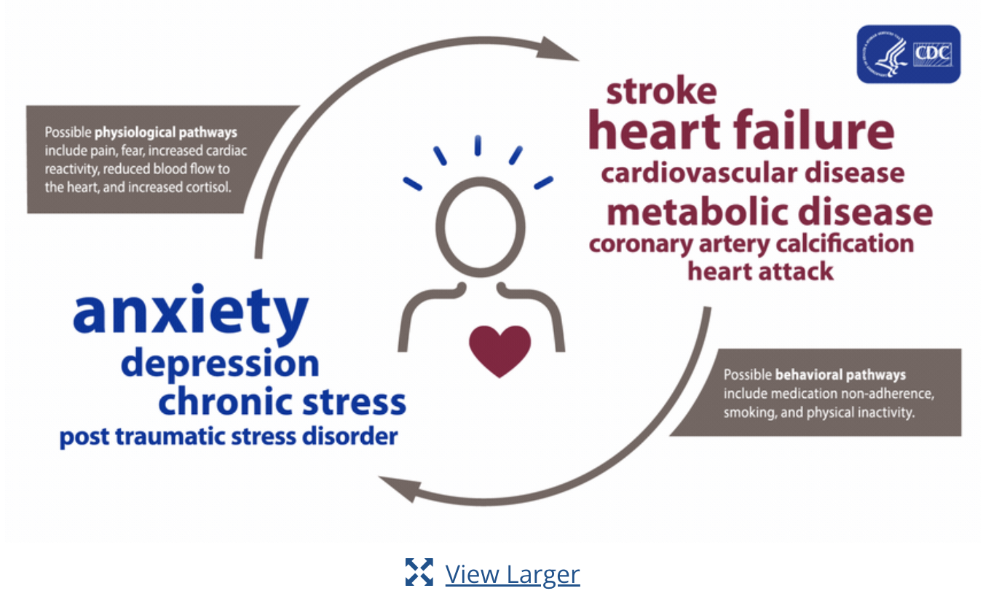

# Mental Health and Heart Disease 



According to the CDC, heart disease is the leading cause of death in the United States averaging nearly 700,000 annual fatalities (source). Heart Disease is closely aligned to personal key indicators. Indicators like physical activity, alcohol usage, and smoking can have an impact on someone's chances of developing heart disease. There is ample research to suggest that a person's mental health can affect a person's ability to be physically active, or sleep well, or other factors that can lead to heart disease. There is also gorwing research to suggest that mental health can affect heart health by biological pathways as well as behavioral pathways. 

The question becomes:

How does the quality of someone's mental health impact their probability of heart disease and impact other contributing factors to having heart disease?

## About the Dataset

The dataset is originally from the CDC's Behavioral Risk Factor Surveillance System (BRFSS). Some basic facts about the survey is that it began in 1984, is conducted annually, and is participants are reached by telephone. The goal is to collect information on the current health status of U.S. residents. Each year the BRFSS collects responses from over 400,000 living adults. For the year we examone. 2020, the data set contains 401,958 rows and 279 columns. 

The survey consisted of questions regarding the status of the survey takers health. For the majority of questions, respondents were simply asked to provide a "yes" or "no" answer. The following provides a breakdown of variables and questions: 

Physical Health: 'For how many days during the past 30 days was your physical health not good?'. 

Mental health: Thinking about your mental health, for how many days during the past 30 days was your mental health not good?

Difficulty Walking: Do you have serious difficulty walking or climbing stairs? 


Kidney disease: Not including kidney stones, bladder infection or incontinence, were you ever told you had kidney disease? 

Smoking: have you smoked at least 100 cigarettes in your entire life? 

The respondent would then reply with a yes or no. Other questions gave the survey takers the option to input their response.  Please see breakdown of question and Variable below: 


BMI: manual input numeric

Race: imputed value

Sleep time: On average, how many hours of sleep do you get in a 24-hour period? Numeric 


Physical Activity: Adults who reported doing physical activity or exercise during the past 30 days other than their regular job

Mental health: Thinking about your mental health, for how many days during the past 30 days was your mental health not good?

Physical health  : For how many days during the past 30 days was your physical health not good?

Lastly, variables were also in certain ranks. This was the case for the variable Age. 

Our dataset, while originally from the CDC, was taken from Kaggle where it was edited to having 18 variables deemed most relevant to heart health.

# Why this Dataset?

The Personal Key indicators of Heart Disease dataset was chosen for various reasons. 

One being that the data had already been brought down to the 18 most relevant variables. From there we were able to pick out variables for our model. 

Another reason for choosing this dataset was the sample size. With over 400,000 observations, the results can be used to make meaningful inferences about the population.  

The main factor to choosing this dataset was the wide range of methods we could use to make models. There was amble categorical values, factor values, and numeric values to use to create a model. 

Categorical Values Include 

* Heart Disease 
* Smoking
* Alcohol Drinking
* Stroke 
* Difficultly Walking
* Sex
* Diabetic 
* Asthma
* Kidney Disease
* Skin Cancer
* Race

Factor/Rank Values Include

* Age 
* General Health

Numeric Values 

* BMI
* Physical Health 
* Mental Health 
* Sleep Time
* Physical Activity 

# Data Editing

```{r init, include=F}
# Housekeeping
#rm(list = ls())


# Packages needed
#tinytex::install_tinytex()
#install.packages("dplyr")      
#install.packages("plyr")       
#install.packages("readr")   
#installed.packages('skimr', repos = "http://cran.us.r-project.org")
#install.packages
#install.packages("panelr")
#install.packages("lubridate")
#install.packages("eeptools")
#install.packages('xtable')
#install.packages('plm')
#install.packages('tseries')
#install.packages('dynlm')
#install.packages('vars')
#install.packages('broom')
#install.packages('stargazer')
#install.packages('lmtests')
#install.packages("kableExtra")
#install.packages('plotly')
#install.packages('GGally')
#install.packages('gplots')
#install.packages('ggpubr')
#install.packages('rstatix') 
library(rstatix)
library(ggpubr)
library(plotly)
library(kableExtra)
library(skimr)
library(panelr)
library(knitr)
library(stargazer)
library(dplyr)
library(readr)
library(lubridate)
library(xtable)
library(plm) 
library(corrplot)
library(tidyverse)
library(tseries) # for `adf.test()`
library(dynlm) #for function `dynlm()`
library(vars) # for function `VAR()`
library(lmtest) #for `coeftest()` and `bptest()`.
library(broom) #for `glance(`) and `tidy()`
library(ezids)
library(plot3D)
library(tinytex)
library(GGally, quietly = TRUE)
library(gplots)
library(gganimate)
#install.packages("AICcmodavg")
library(AICcmodavg)
library(randomForest)
library(dplyr)
library(MASS)
library(ezids)
library(tidyverse)
```


```{r setup, include=FALSE}
knitr::opts_chunk$set(
	message = FALSE,
	warning = FALSE,
	results = "hide"
)

options(scientific=T, digits = 3) 

setwd('/Users/admin/Documents/GitHub/6101_Project/')

df = data.frame(read.csv('/Users/admin/Documents/GitHub/6101_Project/heart_2020_cleaned.csv'))

lapply(df,function(x) { length(which(is.na(x)))})
```

```{r init_data}


# Replace No for Heart Disease with 0
df$HeartDisease[df$HeartDisease == "No"] <- 0
# Replace Yes for Heart Disease with 1
df$HeartDisease[df$HeartDisease == "Yes"] <- 1
# Convert Heart Disease to factor variable
df$HeartDisease <- as.factor(df$HeartDisease)
table(df$HeartDisease)

# Replace No for Smoking with 0
df$Smoking[df$Smoking == "No"] <- 0
# Replace Yes for Smoking with 1
df$Smoking[df$Smoking == "Yes"] <- 1
# Convert Smoking to factor variable
df$Smoking <- as.factor(df$Smoking)
table(df$Smoking)

# Replace No for Alcohol Drinking with 0
df$AlcoholDrinking[df$AlcoholDrinking == "No"] <- 0
# Replace Yes for Alcohol Drinking with 1
df$AlcoholDrinking[df$AlcoholDrinking == "Yes"] <- 1
# Convert Alcohol Drinking to factor variable
df$AlcoholDrinking <- as.factor(df$AlcoholDrinking)
table(df$AlcoholDrinking)

# Replace No for Stroke with 0
df$Stroke[df$Stroke == "No"] <- 0
# Replace Yes for Stroke with 1
df$Stroke[df$Stroke == "Yes"] <- 1
# Convert Stroke to factor variable
df$Stroke <- as.factor(df$Stroke)
table(df$Stroke)

# Replace No for DiffWalking with 0
df$DiffWalking[df$DiffWalking == "No"] <- 0
# Replace Yes for DiffWalking with 1
df$DiffWalking[df$DiffWalking == "Yes"] <- 1
# Convert DiffWalking to factor variable
df$DiffWalking <- as.factor(df$DiffWalking)
table(df$DiffWalking)

# Replace Male for Sex with 0
df$Sex[df$Sex == "Male"] <- 0
# Replace Female for Sex with 1
df$Sex[df$Sex == "Female"] <- 1
# Convert Sex to factor variable
df$Sex <- as.factor(df$Sex)
table(df$Sex)

# Replace No for Physical Activity with 0
df$PhysicalActivity[df$PhysicalActivity == "No"] <- 0
# Replace Yes for Physical Activity with 1
df$PhysicalActivity[df$PhysicalActivity == "Yes"] <- 1
# Convert Physical Activity to factor variable
df$PhysicalActivity <- as.factor(df$PhysicalActivity)
table(df$PhysicalActivity)

# Replace No for Asthma with 0
df$Asthma[df$Asthma == "No"] <- 0
# Replace Yes for Asthma with 1
df$Asthma[df$Asthma == "Yes"] <- 1
# Convert Asthma to factor variable
df$Asthma <- as.factor(df$Asthma)
table(df$Asthma)

# Replace No for Kidney Disease with 0
df$KidneyDisease[df$KidneyDisease == "No"] <- 0
# Replace Yes for Kidney Disease with 1
df$KidneyDisease[df$KidneyDisease == "Yes"] <- 1
# Convert Kidney Disease to factor variable
df$KidneyDisease <- as.factor(df$KidneyDisease)
table(df$KidneyDisease)

# Replace No for Skin Cancer with 0
df$SkinCancer[df$SkinCancer == "No"] <- 0
# Repalce Yes for Skin Cancer with 1
df$SkinCancer[df$SkinCancer == "Yes"] <- 1
# Convert Skin Cancer to factor variable
df$SkinCancer <- as.factor(df$SkinCancer)
table(df$SkinCancer)

# Replace Poor for GenHealth with 0
df$GenHealth[df$GenHealth == "Poor"] <- 0
# Replace Fair for GenHealth with 1
df$GenHealth[df$GenHealth == "Fair"] <- 1
# Replace Good for GenHealth with 2
df$GenHealth[df$GenHealth == "Good"] <- 2
# Replace Very Good for GenHealth with 3
df$GenHealth[df$GenHealth == "Very good"] <- 3
# Replace Excellent for GenHealth with 4
df$GenHealth[df$GenHealth == "Excellent"] <- 4
# Convert GenHealth to factor variable
df$GenHealth <- as.factor(df$GenHealth)
table(df$GenHealth)

# Replace No for Diabetic with 0
df$Diabetic[df$Diabetic == "No"] <- 0
# Replace Yes for Diabetic with 1
df$Diabetic[df$Diabetic == "Yes"] <- 1
# Replace "No, borderline diabetes" with 2
df$Diabetic[df$Diabetic == "No, borderline diabetes"] <- 2
# Replace "Yes (during pregnancy) with 3
df$Diabetic[df$Diabetic == "Yes (during pregnancy)"] <- 3
# Convert Diabetic to factor variable
df$Diabetic <- as.factor(df$Diabetic)
table(df$Diabetic)

# Replace White for Race with 0
df$Race[df$Race == "White"] <- 0
# Replace Black for Race with 1
df$Race[df$Race == "Black"] <- 1
# Replace Hispanic for Race with 2
df$Race[df$Race == "Hispanic"] <- 2
# Replace Asian for Race with 3
df$Race[df$Race == "Asian"] <- 3
# Replace American Indian/Alaskan Native for Race with 4
df$Race[df$Race == "American Indian/Alaskan Native"] <- 4
# Replace Other for Race with 5
df$Race[df$Race == "Other"] <- 5
df$Race <- as.factor(df$Race)
table(df$Race)

df$AgeCategory[df$AgeCategory == "18-24"] <- 0
df$AgeCategory[df$AgeCategory == "25-29"] <- 1
df$AgeCategory[df$AgeCategory == "30-34"] <- 2
df$AgeCategory[df$AgeCategory == "35-39"] <- 3
df$AgeCategory[df$AgeCategory == "40-44"] <- 4
df$AgeCategory[df$AgeCategory == "45-49"] <- 5
df$AgeCategory[df$AgeCategory == "50-54"] <- 6
df$AgeCategory[df$AgeCategory == "55-59"] <- 7
df$AgeCategory[df$AgeCategory == "60-64"] <- 8
df$AgeCategory[df$AgeCategory == "65-69"] <- 9
df$AgeCategory[df$AgeCategory == "70-74"] <- 10
df$AgeCategory[df$AgeCategory == "75-79"] <- 11
df$AgeCategory[df$AgeCategory == "80 or older"] <- 12
df$AgeCategory <- as.factor(df$AgeCategory)
table(df$AgeCategory)
```

This data editing is needed to address what was said in the in the about the data set section. A majority of variables are in the form of "yes" or "no" answers. For variables were this is the case, no's were recoded to 0s and yes's were recoded to 0's. For variables such as race and age category, answers were not numerical but had more than one category. For these, they were recoded into numbers and then the variable was converted into a factor. In our regression analysis, converting the variables to factors proves a good stretgy to easily include them in the regression and produce useful coefficients. A table command was added after every variable that was changed to verify that variables were properly recoded.


# EDA

Here we did some exploratory data analysis to get an idea of what our variables look like. 

```{r, results='markup'}
  
  #bar plot count dependent variable (heart disease)
ggplot(df, aes(x = HeartDisease)) +
  geom_bar(fill = "coral") +
    theme_classic()

table(df$HeartDisease)

```
This graph shows the basic counts of our dependent variable, whether someone has heart disease or not. As is easily seen, an exceptionally large majority of respondent answered no to having heart disease. By adding a table function, we can see that 27,373 respondents have heart disease and 292,422 do not. This comes out to 8.6% of the sample having heart disease.

```{r, results='markup'}

df %>%
  dplyr::select(MentalHealth, PhysicalHealth, BMI, SleepTime) %>%
  gather(variable, value) %>%
  ggplot(aes(x = value)) +
  geom_histogram(fill = "steelblue", color = "black") +
  facet_wrap(~ variable, scales = "free") + # Free scales so the graphs are readable
  labs(title = "Histograms of Numeric Variables", x = "Value", y = "Count") +
  theme_minimal()
```
Here we present histograms of our 4 numeric variable. BMI has a mostly normal distribution clustered around 26/27; there is a small skew to the right that should be noted. Mental health and physical health display similar values in their histograms, this is due to the nature of their questions. They both as about how many days a type of health was bad in the past 30 days. The vast majority of respondents say 0, but then next most popular value is the other extreme, 30. There are also a noticeable, but still small number of respondents that say 1 or 2 days. Lastly, sleep time sort of resembles a normal distribution, but is mostly just two values, 7 and 8, that are commonly reported.

```{r}
df1 = subset(df, select = c("BMI", "PhysicalHealth", "MentalHealth", "SleepTime"))

dfcor = cor(df1)

dfcor
library(ezids)
library(tidyverse)

loadPkg("corrplot")

corrplot(dfcor, method = 'number')

```
# Confusion Matrix 
 
As we can see in the confusion matrix, the logit model, model1 does not affect the target variable (heart disease) significantly. Using the confusion matrix, we can calculate that our model has high accuracy at 91.5%. The misclassification rate is at 8.6%, meaning that the model is wrong 8.6%. However the recall is at 4.8%, which means of the cases that were actually positive, only 4.8% were classified correctly. Additionally, the precision of the model is at 48.97%. This means that when the case is yes, the model accurately predicts yes 48.97% of the time. 

With that analysis, we decided to move our Logit model to a random forest. 


```{r, results='markup'}

table(df$HeartDisease)
model1 <- glm(HeartDisease~MentalHealth + BMI + GenHealth + AgeCategory + Sex + PhysicalHealth + SleepTime, data = df, family = "binomial")
model2 <- glm(HeartDisease~AlcoholDrinking + BMI + PhysicalHealth + GenHealth + AgeCategory + SleepTime + Sex, data = df, family = "binomial")

models <- list (model1, model2)
model.names <- c('model1', 'model2')

summary(model1)


aictab(cand.set = models, modnames = model.names)

```

# Model Selection

Using the AICc, we tested which model would be best to select. When replacing mental health wit alcohol drinking from the model we can see that the AIC increases. So we can see that the better model to use includes mental health. Furthermore, model1 is the better model as it carries 100% of the cumulative model weight. 

Nevertheless the AIC is relatively high at 150349.

```{r, results='markup'}
#Testing the model

loadPkg("regclass")
# confusion_matrix(model1)
xkabledply( confusion_matrix(model1), title = "Confusion matrix from Logit Model" )
unloadPkg("regclass")

```
# Confusion Matrix 
 
As we can see in the confusion matrix, the logit model, model1 does not affect the target variable (heart disease) significantly. In the confusion matrix, we can calculate that the accuracy of this model is high at 91.5%. The misclassification rate is at 8.6% which is not a high amount of errors. 

```{r, results='markup'}
set.seed(2904)
s<-sort(sample(nrow(df),nrow(df)*.8))
train<-df[s,]
test<-df[-s,]
rm(s)


rf2<-randomForest(HeartDisease~MentalHealth + BMI + GenHealth + AgeCategory + Sex + PhysicalHealth + SleepTime,ntree=200,data=train)
rf2


set.seed(2904)
rf<-randomForest(HeartDisease~.,ntree=200,data=train)
rf
plot(rf$err.rate[,1],type="l",main="Random Forest Error Rate",xlab="Number of Trees")
varImpPlot(rf,main="Variable Importance Plot for Random Forest")
rfpred<-predict(rf,test,type="class")
rft<-table(test$HeartDisease,rfpred)
rft

```
# Random Forests 

Since our data is highly unbalanced, we decided a random forest would be best to use as it is more powerful in its accuracy than a standard decision tree. 

I choose to make a random forest that contains 200 trees, and while each tree may be over-fitted on its own. The final result considering all the trees together, will be as prone to the over fitting. The first step I did was split the dataset into train and test where 80% of the data will be used for training and the other 20% will be used for testing. 

We can see that we used every 4 variables at every split, coming from the square-root of 18. Which increases the randomness of our algorithm. 

After running the train data in the random forest model using the same variables as our logit model, we find that the results are still not ideal. We find that the accuracy rate for the random forest is at 91.5%. The recall rate is at 1.7%, so when the case is actually yes, the model only predicts yes 1.7% of the time. The precision is at 49.7% which is higher than the previous model but could be better. Additionally, the misclassification rate is at a 8.59%. So the random forest not making significantly less mistakes. Lastly we can see that our false negative rate is at 98.32%, meaning that 98.32% of the cases that were positive were falsely classified as being negatives. This is an extremely high error rate and we will have to make another model.  


Therefore, we decieded to use all variables to improve the precision of the model. In comparison, the second random forest had  precision rate of 51.8%.  With an accuracy rate of 91.5% and a recall of 8.81%. Furthermore, our false negative rate is at 0.92, meaning that 92% of the cases that were positive were falsely classified as negatives. This is still fairly high, but we can see it is lower than our previous models. The misclassification rate at 8.53%, so it is making the same amount of mistakes as the previous random forest. Nevertheless, we can conclude that this model is the better model to use to explain our target variable. 

Supplemental to the random forest, we included two graphs. One to show that the error rate of the forest levels out at 100 trees and is fairly low. The other to demonstrate the most important variables. As you can see, the most influential variables are BMI, Age, and Sleep time. We did see that sleep time and mental health have a small relationship in the correlation plot. Additionally we can see that mental health is a significant variable. It is the 6th most important variable in a sent of 18 variables. In sum, our best model was the last random forrest showing that BMI, Age, and Sleep time hold the most predictive power in having heart disease. 

# Limitations 

While our model has a high accuracy rate in predicting heart disease, there were a few limitations. 


* Our data was heavily classified towards the no class in terms of heart disease. 
* Mental Health observations were low. Mental Health awareness is still new to the public. People may not realize what having a bad mental health day means or looks like. 
* People who already tested for Heart Disease by the time of the survey may already be taking steps to improve their health. So variables like physical health and mental health may not be enough to predict heart disease. 
* The size of our dataset means more chances for outliers or incorrectly recorded observations. For example, someone who inputs their BMI might incorrectly imput their weight. 

# Future work 

* In the future we would like to use other prediction models to see if an individual at a certain time could be at risk of hart disease regardless of their mental health. 

# Conslusion 

We began this project with the intent to look at risk factors for heart disease. Using data collected from the CDC's Behavioral Risk Factor Surveillance System survey. Specifically we looked at the connection between mental health and heart disease. To do so, we created a logit regression as we were working with classifying data. Our logit regression showed that the more number of days people reported as having poor mental health, the higher chance there is of having heart disease. While the coefficient was statistically significant, the overall model did not produce significant results. This was tested with a random forest. While using the same variables as our logit regression, we found that the was the ability to obtain stronger results. We then chose to make a random forest with all variables to see which personal key indicators were the better predictors than mental health. After doing so we were able to create a model with the best results. Additionally, our model showed that that BMI, Age, and Sleep Time were the most significant predictors. Finally, while mental health may not be the most important factor in predicting heart disease, it is stll the 6h most significant personal key indicator for heart disease. Given the amount of variables we used, this still makes it a rather important variable.

# References 
CDC. (2022, September 6). Leading Causes of Death. National Center for Health Statistics. https://www.cdc.gov/nchs/fastats/leading-causes-of-death.htm

Heart Disease and Mental Health Disorders. (2020, May 6). CDC. https://www.cdc.gov/heartdisease/mentalhealth.htm

## Data dictionary

+----------------+-------+--------------------------------------------+
|Variable        | Codes | Description        |
+================+=======+============================================+
|Heart Disease   |   0,   | No,  | 
|                |   1   | Yes |    
+----------------+-------+---------------------------------------------+
|Smoking         |   0,   | No,            |
|                |   1   | Yes           |
+----------------+-------+---------------------------------------------+
|AlcoholDrinking |   0,   | No,            |
|                |   1   | Yes           |
+----------------+-------+---------------------------------------------+
|Stroke          |   0,   | No,            |
|                |   1   | Yes           |
+----------------+-------+---------------------------------------------+
|DiffWalking     |   0,   | No,            |
|                |   1   | Yes           |
+----------------+-------+---------------------------------------------+
|Sex             |   0,   | No,            |
|                |   1   | Yes           |
+----------------+-------+---------------------------------------------+
|PhysicalActivity|   0,   | No,            |
|                |   1   | Yes           |
+----------------+-------+---------------------------------------------+
|Asthma          |   0,   | No,            |
|                |   1   | Yes           |
+----------------+-------+---------------------------------------------+
|KidneyDisease   |   0,   | No,            |
|                |   1   | Yes           |
+----------------+-------+---------------------------------------------+
|SkinCancer      |   0,   | No,            |
|                |   1   | Yes           |
+----------------+-------+---------------------------------------------+
|GenHealth       |   0,   | Poor,           |
|                |   1,   | Fair,           |
|                |   2,   | Good,           |
|                |   3,   | Very Good,      |
|                |   4   | Excellent      |
+----------------+-------+---------------------------------------------+
|Diabetic        |   0,   | No,            |
|                |   1,   | Yes,           |
|                |   2,   | No, bordeline diabetes,           |
|                |   3   | Yes (during pregnancy)           |
+----------------+-------+---------------------------------------------+
|Race            |   0,   | White,           |
|                |   1,   | Black,           |
|                |   2,   | Hispanic,        |
|                |   3,   | Asian,           |
|                |   4,   | American Indian/Alaskan Native,      |
|                |   5   | Other           |
+----------------+-------+---------------------------------------------+
|AgeCategory     |   0,   | 18-24,          |
|                |   1,   | 25-29,          |
|                |   2,   | 30-34,          |
|                |   3,   | 35-39,          |
|                |   4,   | 40-44,          |
|                |   5,   | 45-49,          |
|                |   6,   | 50-54,          |
|                |   7,   | 55-59,          |
|                |   8,   | 60-64,          |
|                |   9,   | 65-69,          |
|                |   10,  | 70-74,          |
|                |   11,  | 75-79,          |
|                |   12  | 80 or older    |
