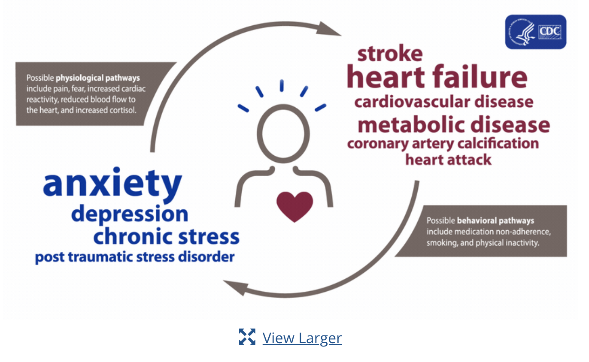

# Predicting Heart Disease 



According to the CDC, heart disease is the leading cause of death in the United States averaging nearly 700,000 annual fatalities (source). Heart Disease is closely aligned to personal key indicators. Indicators like physical activity, alcohol usage, and smoking can have an impact on someone's chances of developing heart disease.  

Given these considerations, our primary research question is:

How can we best predict an individual's risk of developing heart disease based on a combination of these key features?

## About the Dataset

The dataset is originally from the CDC's Behavioral Risk Factor Surveillance System (BRFSS). Some basic facts about the survey is that it began in 1984, is conducted annually, and is participants are reached by telephone. The goal is to collect information on the current health status of U.S. residents. Each year the BRFSS collects responses from over 400,000 living adults. For the year we examone. 2020, the data set contains 401,958 rows and 279 columns. 

The survey consisted of questions regarding the status of the survey takers health. For the majority of questions, respondents were simply asked to provide a "yes" or "no" answer. The following provides a breakdown of variables and questions: 

Physical Health: 'For how many days during the past 30 days was your physical health not good?'. 

Mental health: Thinking about your mental health, for how many days during the past 30 days was your mental health not good?

Difficulty Walking: Do you have serious difficulty walking or climbing stairs? 


Kidney disease: Not including kidney stones, bladder infection or incontinence, were you ever told you had kidney disease? 

Smoking: have you smoked at least 100 cigarettes in your entire life? 

The respondent would then reply with a yes or no. Other questions gave the survey takers the option to input their response.  Please see breakdown of question and Variable below: 


BMI: manual input numeric

Race: imputed value

Sleep time: On average, how many hours of sleep do you get in a 24-hour period? Numeric 


Physical Activity: Adults who reported doing physical activity or exercise during the past 30 days other than their regular job

Mental health: Thinking about your mental health, for how many days during the past 30 days was your mental health not good?

Physical health  : For how many days during the past 30 days was your physical health not good?

Lastly, variables were also in certain ranks. This was the case for the variable Age. 

Our dataset, while originally from the CDC, was taken from Kaggle where it was edited to having 18 variables deemed most relevant to heart health.

# Why this Dataset?

The Personal Key indicators of Heart Disease dataset was chosen for various reasons. 

One being that the data had already been brought down to the 18 most relevant variables. From there we were able to pick out variables for our model. 

Another reason for choosing this dataset was the sample size. With over 400,000 observations, the results can be used to make meaningful inferences about the population.  

The main factor to choosing this dataset was the wide range of methods we could use to make models. There was amble categorical values, factor values, and numeric values to use to create a model. 

Categorical Values Include 

* Heart Disease 
* Smoking
* Alcohol Drinking
* Stroke 
* Difficultly Walking
* Sex
* Diabetic 
* Asthma
* Kidney Disease
* Skin Cancer
* Race

Factor/Rank Values Include

* Age 
* General Health

Numeric Values 

* BMI
* Physical Health 
* Mental Health 
* Sleep Time
* Physical Activity 

# Data Editing

```{r init, include=F}

options(repos = c(CRAN = "https://cran.rstudio.com/"))
# Housekeeping
#rm(list = ls())


# Packages needed
#tinytex::install_tinytex()
#install.packages("dplyr")      
#install.packages("plyr")       
#install.packages("readr")   
#installed.packages('skimr', repos = "http://cran.us.r-project.org")
#install.packages
#install.packages("panelr")
#install.packages("lubridate")
#install.packages("eeptools")
#install.packages('xtable')
#install.packages('plm')
#install.packages('tseries')
#install.packages('dynlm')
#install.packages('vars')
#install.packages('broom')
#install.packages('stargazer')
#install.packages('lmtests')
#install.packages("kableExtra")
#install.packages('plotly')
#install.packages('GGally')
#install.packages('gplots')
#install.packages('ggpubr')
#install.packages('rstatix') 
#install.packages("ROSE")
library(rstatix)
library(ggpubr)
library(plotly)
library(kableExtra)
library(skimr)
library(panelr)
library(knitr)
library(stargazer)
library(dplyr)
library(readr)
library(lubridate)
library(xtable)
library(plm) 
library(corrplot)
library(tidyverse)
library(tseries) # for `adf.test()`
library(dynlm) #for function `dynlm()`
library(vars) # for function `VAR()`
library(lmtest) #for `coeftest()` and `bptest()`.
library(broom) #for `glance(`) and `tidy()`
library(ezids)
library(plot3D)
library(tinytex)
library(GGally, quietly = TRUE)
library(gplots)
library(gganimate)
#install.packages("AICcmodavg")
library(AICcmodavg)
library(randomForest)
library(dplyr)
library(MASS)
library(ezids)
library(tidyverse)
library(randomForest)
library(caret)
library(ROSE)
```


```{r setup, include=FALSE}
knitr::opts_chunk$set(
	message = FALSE,
	warning = FALSE,
	results = "hide"
)

options(scientific=T, digits = 3) 

setwd('/Users/admin/Documents/Int_Data_Science_Project_2')

df = data.frame(read.csv('/Users/admin/Documents/Int_Data_Science_Project_2/heart_2020_cleaned.csv'))

lapply(df,function(x) { length(which(is.na(x)))})
```

```{r init_data}


# Replace No for Heart Disease with 0
df$HeartDisease[df$HeartDisease == "No"] <- 0
# Replace Yes for Heart Disease with 1
df$HeartDisease[df$HeartDisease == "Yes"] <- 1
# Convert Heart Disease to factor variable
df$HeartDisease <- as.factor(df$HeartDisease)
table(df$HeartDisease)

# Replace No for Smoking with 0
df$Smoking[df$Smoking == "No"] <- 0
# Replace Yes for Smoking with 1
df$Smoking[df$Smoking == "Yes"] <- 1
# Convert Smoking to factor variable
df$Smoking <- as.factor(df$Smoking)
table(df$Smoking)

# Replace No for Alcohol Drinking with 0
df$AlcoholDrinking[df$AlcoholDrinking == "No"] <- 0
# Replace Yes for Alcohol Drinking with 1
df$AlcoholDrinking[df$AlcoholDrinking == "Yes"] <- 1
# Convert Alcohol Drinking to factor variable
df$AlcoholDrinking <- as.factor(df$AlcoholDrinking)
table(df$AlcoholDrinking)

# Replace No for Stroke with 0
df$Stroke[df$Stroke == "No"] <- 0
# Replace Yes for Stroke with 1
df$Stroke[df$Stroke == "Yes"] <- 1
# Convert Stroke to factor variable
df$Stroke <- as.factor(df$Stroke)
table(df$Stroke)

# Replace No for DiffWalking with 0
df$DiffWalking[df$DiffWalking == "No"] <- 0
# Replace Yes for DiffWalking with 1
df$DiffWalking[df$DiffWalking == "Yes"] <- 1
# Convert DiffWalking to factor variable
df$DiffWalking <- as.factor(df$DiffWalking)
table(df$DiffWalking)

# Replace Male for Sex with 0
df$Sex[df$Sex == "Male"] <- 0
# Replace Female for Sex with 1
df$Sex[df$Sex == "Female"] <- 1
# Convert Sex to factor variable
df$Sex <- as.factor(df$Sex)
table(df$Sex)

# Replace No for Physical Activity with 0
df$PhysicalActivity[df$PhysicalActivity == "No"] <- 0
# Replace Yes for Physical Activity with 1
df$PhysicalActivity[df$PhysicalActivity == "Yes"] <- 1
# Convert Physical Activity to factor variable
df$PhysicalActivity <- as.factor(df$PhysicalActivity)
table(df$PhysicalActivity)

# Replace No for Asthma with 0
df$Asthma[df$Asthma == "No"] <- 0
# Replace Yes for Asthma with 1
df$Asthma[df$Asthma == "Yes"] <- 1
# Convert Asthma to factor variable
df$Asthma <- as.factor(df$Asthma)
table(df$Asthma)

# Replace No for Kidney Disease with 0
df$KidneyDisease[df$KidneyDisease == "No"] <- 0
# Replace Yes for Kidney Disease with 1
df$KidneyDisease[df$KidneyDisease == "Yes"] <- 1
# Convert Kidney Disease to factor variable
df$KidneyDisease <- as.factor(df$KidneyDisease)
table(df$KidneyDisease)

# Replace No for Skin Cancer with 0
df$SkinCancer[df$SkinCancer == "No"] <- 0
# Repalce Yes for Skin Cancer with 1
df$SkinCancer[df$SkinCancer == "Yes"] <- 1
# Convert Skin Cancer to factor variable
df$SkinCancer <- as.factor(df$SkinCancer)
table(df$SkinCancer)

# Replace Poor for GenHealth with 0
df$GenHealth[df$GenHealth == "Poor"] <- 0
# Replace Fair for GenHealth with 1
df$GenHealth[df$GenHealth == "Fair"] <- 1
# Replace Good for GenHealth with 2
df$GenHealth[df$GenHealth == "Good"] <- 2
# Replace Very Good for GenHealth with 3
df$GenHealth[df$GenHealth == "Very good"] <- 3
# Replace Excellent for GenHealth with 4
df$GenHealth[df$GenHealth == "Excellent"] <- 4
# Convert GenHealth to factor variable
df$GenHealth <- as.factor(df$GenHealth)
table(df$GenHealth)

# Replace No for Diabetic with 0
df$Diabetic[df$Diabetic == "No"] <- 0
# Replace Yes for Diabetic with 1
df$Diabetic[df$Diabetic == "Yes"] <- 1
# Replace "No, borderline diabetes" with 2
df$Diabetic[df$Diabetic == "No, borderline diabetes"] <- 2
# Replace "Yes (during pregnancy) with 3
df$Diabetic[df$Diabetic == "Yes (during pregnancy)"] <- 3
# Convert Diabetic to factor variable
df$Diabetic <- as.factor(df$Diabetic)
table(df$Diabetic)

# Replace White for Race with 0
df$Race[df$Race == "White"] <- 0
# Replace Black for Race with 1
df$Race[df$Race == "Black"] <- 1
# Replace Hispanic for Race with 2
df$Race[df$Race == "Hispanic"] <- 2
# Replace Asian for Race with 3
df$Race[df$Race == "Asian"] <- 3
# Replace American Indian/Alaskan Native for Race with 4
df$Race[df$Race == "American Indian/Alaskan Native"] <- 4
# Replace Other for Race with 5
df$Race[df$Race == "Other"] <- 5
df$Race <- as.factor(df$Race)
table(df$Race)

df$AgeCategory[df$AgeCategory == "18-24"] <- 0
df$AgeCategory[df$AgeCategory == "25-29"] <- 1
df$AgeCategory[df$AgeCategory == "30-34"] <- 2
df$AgeCategory[df$AgeCategory == "35-39"] <- 3
df$AgeCategory[df$AgeCategory == "40-44"] <- 4
df$AgeCategory[df$AgeCategory == "45-49"] <- 5
df$AgeCategory[df$AgeCategory == "50-54"] <- 6
df$AgeCategory[df$AgeCategory == "55-59"] <- 7
df$AgeCategory[df$AgeCategory == "60-64"] <- 8
df$AgeCategory[df$AgeCategory == "65-69"] <- 9
df$AgeCategory[df$AgeCategory == "70-74"] <- 10
df$AgeCategory[df$AgeCategory == "75-79"] <- 11
df$AgeCategory[df$AgeCategory == "80 or older"] <- 12
df$AgeCategory <- as.factor(df$AgeCategory)
table(df$AgeCategory)
```

This data editing is needed to address what was said in the in the about the data set section. A majority of variables are in the form of "yes" or "no" answers. For variables were this is the case, no's were recoded to 0s and yes's were recoded to 0's. For variables such as race and age category, answers were not numerical but had more than one category. For these, they were recoded into numbers and then the variable was converted into a factor. In our regression analysis, converting the variables to factors proves a good stretgy to easily include them in the regression and produce useful coefficients. A table command was added after every variable that was changed to verify that variables were properly recoded.


# Class Imbalance 

We can see that there is a high class imbalance in the dataset. This will be accounted for in the model selection. We will see if the class imbalance will lead to a better model or not.


# EDA

Here we did some exploratory data analysis to get an idea of what our variables look like. 

```{r, results='markup'}
  
  #bar plot count dependent variable (heart disease)
ggplot(df, aes(x = HeartDisease)) +
  geom_bar(fill = "coral") +
    theme_classic()

table(df$HeartDisease)

```
This graph shows the basic counts of our dependent variable, whether someone has heart disease or not. As is easily seen, an exceptionally large majority of respondent answered no to having heart disease. By adding a table function, we can see that 27,373 respondents have heart disease and 292,422 do not. This comes out to 8.6% of the sample having heart disease.

```{r, results='markup'}

df %>%
  dplyr::select(MentalHealth, PhysicalHealth, BMI, SleepTime) %>%
  gather(variable, value) %>%
  ggplot(aes(x = value)) +
  geom_histogram(fill = "steelblue", color = "black") +
  facet_wrap(~ variable, scales = "free") + # Free scales so the graphs are readable
  labs(title = "Histograms of Numeric Variables", x = "Value", y = "Count") +
  theme_minimal()
```
Here we present histograms of our 4 numeric variable. BMI has a mostly normal distribution clustered around 26/27; there is a small skew to the right that should be noted. Mental health and physical health display similar values in their histograms, this is due to the nature of their questions. They both as about how many days a type of health was bad in the past 30 days. The vast majority of respondents say 0, but then next most popular value is the other extreme, 30. There are also a noticeable, but still small number of respondents that say 1 or 2 days. Lastly, sleep time sort of resembles a normal distribution, but is mostly just two values, 7 and 8, that are commonly reported.

```{r}
df1 = subset(df, select = c("BMI", "PhysicalHealth", "MentalHealth", "SleepTime"))

dfcor = cor(df1)

dfcor
library(ezids)
library(tidyverse)

loadPkg("corrplot")

corrplot(dfcor, method = 'number')

```
 

# Model Selection

```{r, results='markup'}
nrow(df)

# Install required packages (if not already done)
#install.packages("xgboost")
library(xgboost)
library(caret)  # for data partitioning and confusion matrix

```

# Preparing the Data

```{r, results='markup'}

# Splitting the Data
index <- createDataPartition(df$HeartDisease, p = 0.7, list = FALSE)
train_data <- df[index, ]
test_data <- df[-index, ]

# Convert the HeartDisease column to numeric for both train and test sets
train_data$HeartDisease <- as.numeric(as.character(train_data$HeartDisease))
test_data$HeartDisease <- as.numeric(as.character(test_data$HeartDisease))

# Convert datasets to matrix format (without intercept column)
train_data_matrix <- model.matrix(HeartDisease ~ . - 1, train_data)
test_data_matrix <- model.matrix(HeartDisease ~ . - 1, test_data)

dtrain <- xgb.DMatrix(data = train_data_matrix, label = train_data$HeartDisease)
dtest <- xgb.DMatrix(data = test_data_matrix, label = test_data$HeartDisease)


```


# Training the UnBalanced Model
```{r, results='markup'}

# Set model parameters for unbalanced model
params_unbalanced <- list(
  objective = "binary:logistic",
  eval_metric = "logloss"
)

set.seed(123)
model_xgb_unbalanced <- xgb.train(params = params_unbalanced, 
                                  data = dtrain, 
                                  nrounds = 100, 
                                  watchlist = list(train = dtrain, test = dtest))


```

# Training the Balanced Model
```{r, results ='markup'}

# Compute the ratio of negative to positive samples
ratio <- sum(train_data$HeartDisease == 0) / sum(train_data$HeartDisease == 1)

# Set model parameters for balanced model
params_balanced <- list(
  objective = "binary:logistic",
  eval_metric = "logloss",
  scale_pos_weight = ratio
)

set.seed(123)
model_xgb_balanced <- xgb.train(params = params_balanced, 
                                data = dtrain, 
                                nrounds = 100, 
                                watchlist = list(train = dtrain, test = dtest))

```

# Evaluating the Models

```{r, results='markup'}

# Unbalanced model predictions
preds_prob_unbalanced <- predict(model_xgb_unbalanced, dtest)
preds_unbalanced <- ifelse(preds_prob_unbalanced > 0.5, 1, 0)

# Balanced model predictions
preds_prob_balanced <- predict(model_xgb_balanced, dtest)
preds_balanced <- ifelse(preds_prob_balanced > 0.5, 1, 0)

# Ensure that predictions and actuals are both factors with same levels
preds_factor_unbalanced <- factor(preds_unbalanced, levels = c(0, 1))
preds_factor_balanced <- factor(preds_balanced, levels = c(0, 1))
test_data_factor <- factor(test_data$HeartDisease, levels = c(0, 1))

# Compute confusion matrices
cm_unbalanced <- confusionMatrix(preds_factor_unbalanced, test_data_factor)
cm_balanced <- confusionMatrix(preds_factor_balanced, test_data_factor)


```

# Results 
```{r, results='markup'}

# Display the results for both models
cat("Results for Unbalanced Model:\n")
print(cm_unbalanced)

cat("\nResults for Balanced Model:\n")
print(cm_balanced)
```


# Results 
Unbalanced Model Results:

Accuracy: 91.5% - This is high but be careful, in imbalanced datasets, a high accuracy can be misleading.
Sensitivity (Recall for Positive class): 99.22% - Of those that were actually 0 (No Heart Disease), 99.22% were correctly predicted as 0.
Specificity: 9.55% - Of those that were actually 1 (Has Heart Disease), only about 9.55% were correctly predicted.
Pos Pred Value (Precision for Positive class): 92.14% - Of those predicted as 0, 92.14% were actually 0.
Neg Pred Value: 53.48% - Of those predicted as 1, 53.48% were actually 1.
Balanced Accuracy: 54.39% - This is the average of sensitivity and specificity. Given the imbalance in the dataset, this is a crucial metric to look at.
Balanced Model Results:

Accuracy: 75.2%
Sensitivity: 75.1% - A significant drop from the unbalanced model, but this is more realistic.
Specificity: 76.0% - A big jump from the unbalanced model. The balanced model is much better at identifying those with heart disease.
Pos Pred Value: 97.1% - Still high.
Neg Pred Value: 22.2% - A decrease compared to the unbalanced model.
Balanced Accuracy: 75.6% - A more balanced performance on both classes.
From these results, we can infer:

The unbalanced model is much better at predicting the negative class (no heart disease) but performs poorly at predicting the positive class (has heart disease).
The balanced model provides a more even performance between the classes, though with a drop in overall accuracy.
This highlights why it's essential to consider multiple metrics and not just accuracy, especially with imbalanced datasets. Depending on the objective, you might prefer the balanced model because it's more equitable in its predictions across both classes. If the goal is to ensure fewer false negatives (i.e., predicting no heart disease when there is one), the balanced model might be more desirable.


# Limitations 

**Class Imbalance:** The dataset had a significant class imbalance, which can lead to models being biased towards the majority class. Even though we tried to mitigate this with a balanced model, there are other methods like oversampling, undersampling, and synthetic data generation that might further improve performance.

**Feature Selection:** We used all available features for predictions. Some features might not be significant predictors, potentially introducing noise into the model.

**Hyperparameter Tuning:** While we adjusted some parameters for balancing, a comprehensive hyperparameter tuning using techniques like grid search or random search can further optimize the model.

**Model Interpretability:** XGBoost, being a gradient-boosted algorithm, isn't as interpretable as simpler models, making it more challenging to understand feature influences.

**External Validation:** The model was tested on data from the same source. It might behave differently on data from another source or demographic.

# Future work 

**Feature Engineering:** Deriving new features or transforming existing ones might improve prediction accuracy.

**Ensemble Methods:** Combining the predictions of several models might lead to better and more stable results.

**Deep Learning:** Neural networks, especially with structured data, can be explored for potential improvements in prediction accuracy.

**Model Interpretation Tools:** Tools like SHAP (SHapley Additive exPlanations) can be used to gain more insight into feature influences in XGBoost.

**External Validation:** It's crucial to test the model on an external dataset, preferably from a different source or demographic, to ensure its robustness.

**Temporal Validation:** If the dataset is extended with timestamps, models can be validated on future data, ensuring their effectiveness over time.


# Conslusion 

Using the XGBoost algorithm, we sought to predict heart disease based on various features in our dataset. By training both unbalanced and balanced models, we aimed to provide a comprehensive approach, understanding that class imbalance can potentially lead to misleading results. The balanced model, created by adjusting the scale_pos_weight parameter, showed a more equitable prediction performance across both classes, making it especially valuable when aiming to reduce the number of false negatives, which can have serious consequences in healthcare predictions.

# References 
CDC. (2022, September 6). Leading Causes of Death. National Center for Health Statistics. https://www.cdc.gov/nchs/fastats/leading-causes-of-death.htm

Heart Disease and Mental Health Disorders. (2020, May 6). CDC. https://www.cdc.gov/heartdisease/mentalhealth.htm

## Data dictionary

+----------------+-------+--------------------------------------------+
|Variable        | Codes | Description        |
+================+=======+============================================+
|Heart Disease   |   0,   | No,  | 
|                |   1   | Yes |    
+----------------+-------+---------------------------------------------+
|Smoking         |   0,   | No,            |
|                |   1   | Yes           |
+----------------+-------+---------------------------------------------+
|AlcoholDrinking |   0,   | No,            |
|                |   1   | Yes           |
+----------------+-------+---------------------------------------------+
|Stroke          |   0,   | No,            |
|                |   1   | Yes           |
+----------------+-------+---------------------------------------------+
|DiffWalking     |   0,   | No,            |
|                |   1   | Yes           |
+----------------+-------+---------------------------------------------+
|Sex             |   0,   | No,            |
|                |   1   | Yes           |
+----------------+-------+---------------------------------------------+
|PhysicalActivity|   0,   | No,            |
|                |   1   | Yes           |
+----------------+-------+---------------------------------------------+
|Asthma          |   0,   | No,            |
|                |   1   | Yes           |
+----------------+-------+---------------------------------------------+
|KidneyDisease   |   0,   | No,            |
|                |   1   | Yes           |
+----------------+-------+---------------------------------------------+
|SkinCancer      |   0,   | No,            |
|                |   1   | Yes           |
+----------------+-------+---------------------------------------------+
|GenHealth       |   0,   | Poor,           |
|                |   1,   | Fair,           |
|                |   2,   | Good,           |
|                |   3,   | Very Good,      |
|                |   4   | Excellent      |
+----------------+-------+---------------------------------------------+
|Diabetic        |   0,   | No,            |
|                |   1,   | Yes,           |
|                |   2,   | No, bordeline diabetes,           |
|                |   3   | Yes (during pregnancy)           |
+----------------+-------+---------------------------------------------+
|Race            |   0,   | White,           |
|                |   1,   | Black,           |
|                |   2,   | Hispanic,        |
|                |   3,   | Asian,           |
|                |   4,   | American Indian/Alaskan Native,      |
|                |   5   | Other           |
+----------------+-------+---------------------------------------------+
|AgeCategory     |   0,   | 18-24,          |
|                |   1,   | 25-29,          |
|                |   2,   | 30-34,          |
|                |   3,   | 35-39,          |
|                |   4,   | 40-44,          |
|                |   5,   | 45-49,          |
|                |   6,   | 50-54,          |
|                |   7,   | 55-59,          |
|                |   8,   | 60-64,          |
|                |   9,   | 65-69,          |
|                |   10,  | 70-74,          |
|                |   11,  | 75-79,          |
|                |   12  | 80 or older    |
